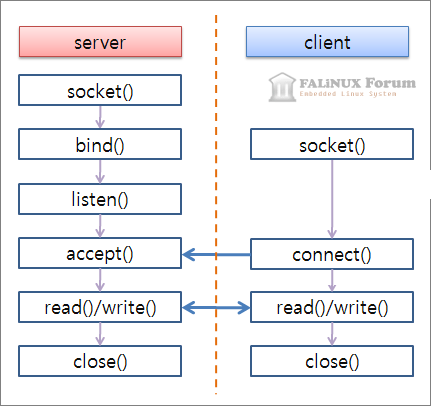

# Proxy Server

2022-1학기 시스템프로그래밍 프로젝트

`소켓 프로그래밍`을 이용한 프록시 서버 구현 프로젝트

프록시 서버는 클라이언트와 서버 간의 매개체 역할을 하며, 캐싱 기능을 수행합니다.

    클라이언트의 request에 대한 서버의 response를 프록시 서버에 저장해, 처리 속도를 개선합니다.

그리고 프록시 서버가 받은 request의 기록을 모두 저장합니다.

---

    # 소켓 프로그래밍

    데이터를 송수신하기 위한 엔드포인트인 소켓을 이용하여 네트워크를 통해 컴퓨터 간의 통신을 가능하게 하는 기법

